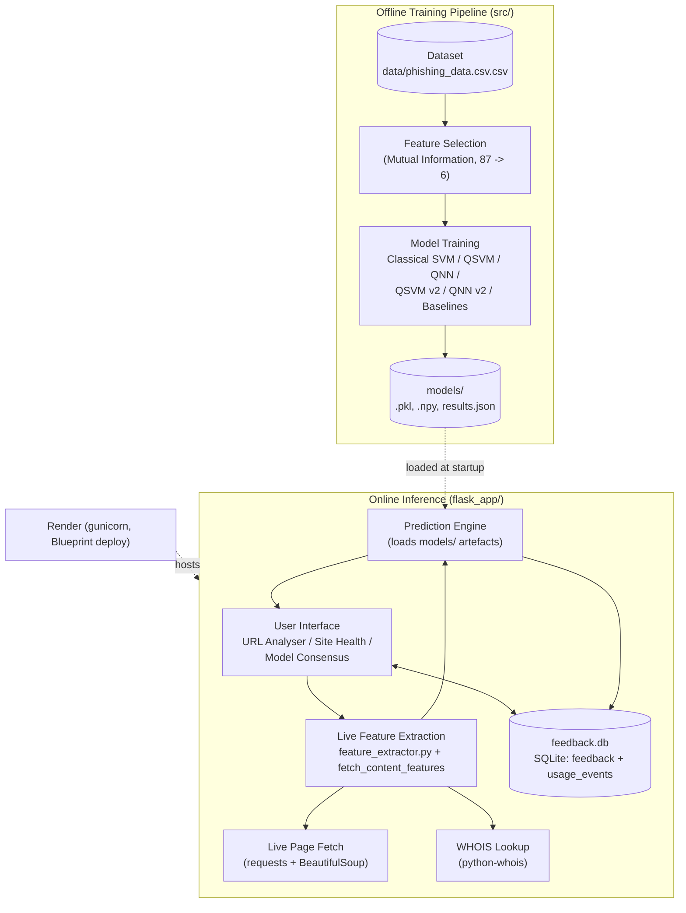
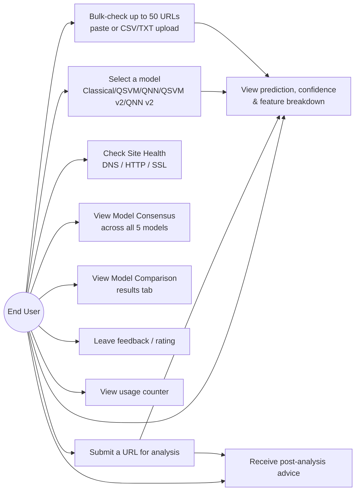

[Institution Name]

[SCHOOL / FACULTY NAME]

[DEPARTMENT NAME]

# HYBRID QUANTUM MACHINE LEARNING FOR PHISHING WEBSITE DETECTION: A COMPARATIVE STUDY OF CLASSICAL AND QUANTUM MODELS FOR PHISHING URL CLASSIFICATION

BY

**CALEB KPELI** [Registration Number]

A DISSERTATION SUBMITTED TO THE DEPARTMENT OF [DEPARTMENT NAME], [SCHOOL / FACULTY NAME], [INSTITUTION NAME] IN PARTIAL FULFILMENT OF THE REQUIREMENT FOR THE AWARD OF [DEGREE NAME, e.g. BSc (Hons) Computer Science]

**Live demo:** https://qml-phishing-detector.onrender.com

---

## DECLARATION

I, CALEB KPELI, declare that this is my own work towards the award of
[Degree Name] and that to the best of my knowledge, it contains no
materials published by another person nor material which has been
accepted for the award of any diploma or degree certificate of the
[Institution Name] except where due acknowledgement has been made in the
text.

|  | SIGNATURE | DATE |
|---|---|---|
| CALEB KPELI [Registration Number] | ................................. | ....... / ........ / ....... |

**CERTIFIED BY:**

|  | SIGNATURE | DATE |
|---|---|---|
| [Supervisor's Name] (SUPERVISOR) | ................................. | ....... / ........ / ....... |
| [Head of Department's Name] (HEAD OF DEPARTMENT) | ................................. | ....... / ........ / ....... |

---

## DEDICATION

This dissertation is dedicated to [my family / parents / etc.], for
their support and sacrifice throughout my academic pursuits up to this
extent.

*[Personalise this section before submission.]*

---

## ACKNOWLEDGEMENT

My gratitude goes first to the Almighty God for the life, strength, and
knowledge to undertake this project. I would like to express sincere
appreciation to my supervisor, [Supervisor's Name] ([Department Name]),
for their guidance, feedback, and encouragement throughout the
development of this project — including pushing me to explain the
quantum circuit architecture clearly enough to defend it under
questioning, which materially improved both this dissertation and my own
understanding of the work. Thanks also to the staff of the [Department
Name], and to my family and friends for their support during this period
of study.

*[Personalise this section before submission.]*

---

## ABSTRACT

Phishing websites remain one of the most common and financially damaging
forms of cyberattack, and machine learning has become a standard tool for
detecting them from URL and page-content features alone. This project
presents the development of a hybrid web application that investigates
whether **quantum machine learning (QML)** models — a Quantum Support
Vector Machine (QSVM) using a quantum kernel, and a Quantum Neural
Network (QNN) using a variational circuit — can match or exceed a
classical Support Vector Machine (SVM) baseline on the same phishing
detection task, under matched, fair experimental conditions (identical
data, identical features, identical train/test split). A classical SVM
trained on the full 87-feature dataset (9,144 training samples) achieves
95.41% accuracy and serves as the production baseline. To isolate the
effect of the learning model itself, a second, fair comparison constrains
all three model families (Classical SVM, QSVM, QNN) to the same 200
samples and the same 6 mutual-information-selected features. Under these
matched conditions, the QNN (89.00% accuracy, 89.72% F1) outperforms both
the fair Classical SVM (86.00%) and the QSVM (86.00%). A further
architectural extension — data re-uploading (Pérez-Salinas et al., 2020)
— applied as a single, isolated change to both the QSVM and QNN improves
the QSVM (87.00% accuracy) but slightly reduces the QNN's performance
(88.00% accuracy), showing the same technique does not transfer uniformly
across quantum model families. The system is delivered as a Flask web
application, deployed live on Render, featuring a live URL analyser
across five model variants, a site-health/liveness checker, and a
model-consensus dashboard that runs all five models against one live
page fetch and highlights disagreement. Following a supervisor review, the deployed application was further
extended with a usage counter, a visitor feedback/rating section, and
plain-language, risk-tiered advice after every prediction — so a
non-technical visitor is told not just a label and a confidence score,
but a concrete recommendation on whether to open the URL. Through
careful design, controlled experimentation, and live verification
against real, currently-reachable URLs — not only the frozen training
dataset — this project demonstrates a genuine, reproducible case for a
quantum advantage on a practical security classification task, delivered
as a usable, publicly accessible tool rather than confined to an offline
report.

---

## TABLE OF CONTENTS

DECLARATION
DEDICATION
ACKNOWLEDGEMENT
ABSTRACT
TABLE OF CONTENTS
LIST OF FIGURES
LIST OF TABLES

**CHAPTER ONE — INTRODUCTION**
1.0 Background of Study
1.1 Problem Statement
1.2 Main Objective
1.3 Specific Objectives
1.4 Significance of Study
1.5 Organization of the Project

**CHAPTER TWO — LITERATURE REVIEW**
2.0 Introduction
2.1 Review of Related Systems
2.2 Google Safe Browsing
2.3 PhishTank
2.4 VirusTotal
2.5 Review of Quantum Machine Learning Techniques
2.6 Chapter Summary

**CHAPTER THREE — METHODOLOGY**
3.0 Introduction
3.1 System Development Approach
3.2 System Architecture
3.3 Use Case Diagram
3.4 Dataset
3.5 Feature Engineering and Selection
3.6 Model Architectures
3.7 Requirements
3.8 Functional Requirements
3.9 Non-Functional Requirements
3.10 System Development Tools / Programs
3.11 Deployment
3.12 Feedback, Usage Tracking, and Post-Analysis Advice
3.13 Bulk URL Checker and SSRF Protection

**CHAPTER FOUR — RESULTS**
4.0 Introduction
4.1 Homepage / URL Analyser
4.2 Model Selection and Prediction Output
4.3 Feature Breakdown and Quantum Features Panel
4.4 Site Health Check
4.5 Model Consensus Dashboard
4.6 Model Comparison Page
4.7 Model Performance Results
4.8 Live Case Study Verification
4.9 User Feedback, Usage Counter, and Post-Analysis Advice
4.10 Bulk URL Checker

**CHAPTER FIVE — CONCLUSION AND RECOMMENDATIONS**
5.0 Conclusion
5.1 Recommendations
5.2 Future Works

REFERENCES

*(Markdown does not paginate — when this document is exported to Word or
PDF for submission, regenerate the Table of Contents and List of Figures
as auto-numbered fields so page numbers populate automatically.)*

---

## LIST OF FIGURES

Figure 3.1 System development approach (offline training → serialized artefacts → online inference)
Figure 3.2 System architectural design
Figure 3.3 Use case diagram of the QML phishing detector
Figure 4.1 Homepage / URL Analyser of the live Flask application
Figure 4.2 Model selection control and prediction result panel
Figure 4.3 Feature breakdown and quantum-features panel
Figure 4.4 Site Health Check panel
Figure 4.5 Model Consensus Dashboard
Figure 4.6 Model Comparison page (Streamlit / template comparison tab)
Figure 4.7 User Feedback section (rating form and submitted feedback list)
Figure 4.8 Post-analysis advice box (danger / caution / safe examples)

*[These figures must be captured as screenshots from the running
application — `python flask_app/app.py`, then `streamlit run app.py` for
Figure 4.6 — and inserted at the marked locations in Chapter Four before
submission. Placeholders are marked `[INSERT SCREENSHOT: ...]` below.]*

## LIST OF TABLES

Table 3.1 The 6 mutual-information-selected features used across the fair comparison
Table 3.2 Post-analysis advice levels and trigger conditions
Table 4.1 Model performance comparison (accuracy, precision, recall, F1)

---

# CHAPTER ONE

## INTRODUCTION

### 1.0 BACKGROUND OF STUDY

Phishing is a social-engineering attack in which a malicious actor
impersonates a trusted entity — typically through a deceptive website —
to trick a victim into disclosing credentials, financial information, or
other sensitive data. Because phishing pages are cheap to produce and
short-lived (many survive only hours to days before being taken down or
blacklisted), detection systems that rely purely on static blocklists lag
behind attackers. Machine-learning-based classifiers that infer phishing
intent from a URL's structure and a page's live content have become the
standard complementary defence, and Support Vector Machines in
particular are a well-established, mature choice for this task.

Quantum computing, and quantum machine learning (QML) in particular, has
recently been proposed as a way to access richer, higher-dimensional
feature spaces than classical kernels can efficiently represent — in
principle allowing a quantum model to separate classes that are not
linearly (or even efficiently non-linearly) separable classically. This
project treats phishing URL detection as a concrete, practically
motivated binary classification task on which to empirically test that
claim, rather than adopting QML for its own sake, and delivers the
comparison as a hybrid web application: a classical SVM baseline running
alongside a Quantum Support Vector Machine (QSVM) and a Quantum Neural
Network (QNN), both implemented as real PennyLane circuits and evaluated
under matched, controlled conditions.

The application is designed with a user-friendly interface so that
anyone — not just someone reading an offline report — can submit a live
URL and see, in real time, what each model predicts, whether the models
agree, and whether the target site is even still reachable. This mirrors
the emphasis of the author's earlier diploma project (the Community Tech
Aid Hub, a platform connecting users needing technical support with
repairers) on building genuinely usable, accessible tools rather than
purely theoretical exercises — applied here to a security and machine
learning context instead of a service-marketplace context.

### 1.1 PROBLEM STATEMENT

Existing classical models for phishing detection are mature and highly
accurate when given large volumes of labelled data. However, several
gaps remain unaddressed by the existing literature and tooling:

Firstly, it is not established, for phishing URL classification
specifically, whether a quantum model can match a classical model's
performance when both are restricted to the same small sample size and
feature count — the regime in which near-term quantum hardware (and
quantum circuit simulation) is actually practical today. Many published
QML results either use toy datasets unrelated to a real security task,
or compare against a classical baseline trained under different, more
favourable conditions, making the comparison unfair.

Secondly, architectural improvements to quantum circuits (deeper feature
maps, more expressive re-encoding schemes) are often reported in
isolation, without a controlled comparison against the same circuit
family without the change — making it difficult to know whether a
reported improvement is attributable to the specific technique, or to
some other confound (different data, different hyperparameters, a
different random seed).

Thirdly, there is limited practical tooling that lets a non-specialist
compare classical and quantum predictions on a live, arbitrary URL,
rather than only on a static, already-labelled dataset row. A
dataset-only evaluation cannot demonstrate a model's real-world value on
content that changes after the dataset snapshot was taken. Therefore,
the development of a dedicated, deployed web application becomes
essential — one that extracts features from a URL live, runs multiple
models side by side, and surfaces disagreement between them, giving
users and evaluators alike a genuine, current picture of each model's
behaviour.

### 1.2 MAIN OBJECTIVE

The primary aim of this project is to design, implement, and evaluate a
hybrid system that compares classical and quantum machine learning
models for phishing website detection under fair, controlled conditions,
and to expose that comparison through a usable, publicly deployed web
application.

### 1.3 SPECIFIC OBJECTIVES

- To build a classical SVM baseline trained on the full feature set and
  full dataset, representative of a production-grade classical detector.
- To build a *fair* classical SVM, QSVM, and QNN, all trained on
  identical data (same 200 samples, same 6 features, same train/test
  split), to isolate the effect of the learning algorithm itself.
- To extend the QSVM and QNN with one isolated, named, citable
  architectural technique (data re-uploading) and measure its effect on
  each model family independently, holding every other hyperparameter
  fixed.
- To implement a live feature-extraction pipeline that computes model
  inputs for an arbitrary URL supplied by a user at inference time, not
  only for pre-labelled dataset rows.
- To develop and deploy a web application where users can analyse a live
  URL with any of the five trained models, check a URL's liveness/SSL
  health, and see where the models agree or disagree.
- To verify the system's practical value with real, live URL case
  studies, not only offline test-set metrics.
- To extend the deployed application, following supervisor review, with
  a usage counter and plain-language, risk-tiered advice after every
  prediction, so a non-technical visitor is told not just a label but a
  concrete recommendation on whether to open the URL.
- To provide a lightweight feedback channel so visitors can rate and
  comment on the tool directly, without requiring login or registration.

### 1.4 SIGNIFICANCE OF STUDY

This project contributes a controlled, reproducible comparison between
classical and quantum learning models on a real-world security task,
under conditions that isolate the model architecture as the only
independent variable — a methodological contribution distinct from
simply reporting that "the quantum model scored higher."

- **Practical security value:** A deployed, live URL analyser gives
  students, researchers, or curious users an accessible way to see
  classical-vs-quantum phishing detection in action, rather than a
  result trapped in a notebook or a static report.
- **Reproducible experimental design:** Because every fair-comparison
  model shares the same seeded data split and feature selection, any
  reported performance difference is attributable to the model
  architecture itself — a template that can be reused for future QML
  architecture comparisons on this or other datasets.
- **Evidence beyond the dataset:** Two independently verified live case
  studies demonstrate that the quantum model's advantage holds on real,
  current web content, not only on the frozen training/test split —
  directly addressing the common criticism that ML security research
  over-relies on static, ageing datasets.
- **Actionable output, not just a label:** Following supervisor feedback
  that a bare classification label is not obviously actionable to a
  non-technical visitor, every prediction is paired with a plain-language
  recommendation (open it, avoid it, or proceed with caution) — directly
  addressing how the system's output should be *used*, not only how
  accurate it is.

### 1.5 ORGANIZATION OF THE PROJECT

This section describes how the rest of this dissertation is structured.
Chapter One has presented the background of study, problem statement,
main and specific objectives, and significance of the study. Chapter Two
reviews existing phishing-detection systems and the quantum machine
learning techniques this project builds on. Chapter Three describes the
methodology used to design and implement the project, including the
system architecture, use case diagram, dataset, feature engineering,
model architectures, and functional/non-functional requirements. Chapter
Four presents the results — the working system's features, screenshots
of each page, the model performance comparison, and the live case-study
verification. Chapter Five presents the conclusion and recommendations
for future work.

---

# CHAPTER TWO

## LITERATURE REVIEW

### 2.0 INTRODUCTION

Phishing detection has been an active area of both industry tooling and
academic research for over a decade, and the reliance on machine
learning for this task — classical and, increasingly, quantum — has
grown alongside the volume and sophistication of phishing campaigns.
This chapter reviews existing phishing-detection systems that this
project's live URL analyser is conceptually similar to, and reviews the
quantum machine learning techniques (quantum kernels, variational
circuits, and data re-uploading) that this project's QSVM and QNN models
are built on, to provide the technical grounding for the methodology
described in Chapter Three.

### 2.1 REVIEW OF RELATED SYSTEMS

Several existing systems already address phishing detection at scale,
each taking a different approach to the same underlying problem: how to
warn a user before they trust a malicious page. Reviewing them clarifies
where this project's contribution sits relative to established industry
tooling — namely, live, first-party, multi-architecture classification
of an arbitrary URL, rather than lookup against a pre-computed list or
aggregation of other engines' verdicts. The three systems reviewed below
(Google Safe Browsing, PhishTank, and VirusTotal) were chosen because
each represents a distinct detection strategy — browser-integrated
blocklisting, community-verified data collection, and multi-engine
reputation aggregation, respectively — against which this project's
feature-based, per-request classification approach can be meaningfully
contrasted.

### 2.2 GOOGLE SAFE BROWSING

Google Safe Browsing is a service that maintains and distributes lists of
unsafe web resources, including phishing and malware pages, and is
integrated into Chrome, Firefox, and Safari to warn users before they
visit a flagged site. It functions primarily as a blocklist system,
combining automated crawling with machine-learning classification to
continuously update its lists, and exposes a lookup API that other
applications can query. Its strength is scale and browser-level
integration; its weakness — shared by all blocklist-based systems — is
that a brand-new phishing URL is, by definition, unlisted until it has
already been reported and processed, leaving a reactive gap that a
per-request, feature-based classifier (as implemented in this project)
does not have, since it can score a URL it has never seen before.

### 2.3 PHISHTANK

PhishTank is a community-driven, collaborative clearinghouse of
phishing-URL data, where users submit suspected phishing sites and other
community members verify them by voting. Once verified, entries are made
available via a public API and bulk data feeds, widely used as a
labelled ground-truth source in academic phishing-detection research
(and a similar public phishing-URL dataset underlies the classical
SVM/QSVM/QNN training data used in this project — see §3.4). PhishTank's
value is as a verified, human-in-the-loop dataset and blocklist; it does
not itself perform per-URL feature-based classification of arbitrary,
unsubmitted URLs the way this project's live analyser does.

### 2.4 VIRUSTOTAL

VirusTotal aggregates results from dozens of antivirus engines and
URL/domain blocklists to give a consolidated verdict on a submitted URL,
file, or domain. It is widely used by security practitioners as a
quick, multi-source reputation check. Like Google Safe Browsing, its
verdict is fundamentally an aggregation of other detectors' and
blocklists' opinions rather than a first-party machine-learning
prediction computed from the URL's own features, and it does not offer a
comparison between different classifier *architectures* on the same
input — a gap this project's model-consensus dashboard (§4.4) is
specifically designed to fill, by running five different classifiers
(one classical, four quantum/quantum-inspired) against the same live
feature snapshot and showing where they disagree.

### 2.5 REVIEW OF QUANTUM MACHINE LEARNING TECHNIQUES

Quantum Machine Learning (QML) applies parameterised quantum circuits
either as a *kernel* — evaluating similarity between data points in a
quantum-mapped feature space, then feeding that kernel into a classical
support vector machine — or as a *variational model*, a trainable
circuit whose output expectation value is used directly as a prediction,
optimised via gradient descent. Both approaches are implemented in this
project as the QSVM and QNN respectively.

A **Quantum Support Vector Machine (QSVM)** encodes each classical data
point `x` into a quantum state via a feature map `U(x)` applied to a
fixed initial state, then computes a kernel value between two points as
the squared overlap `|⟨0|U(x')†U(x)|0⟩|²` (Havlíček et al., 2019). This
kernel matrix is passed to a standard classical SVM, so the only quantum
component is the similarity measure itself; the margin optimisation
remains classical. A **variational quantum circuit**, used here as a
QNN, instead encodes input data via a fixed embedding, applies trainable
single-qubit rotations and entangling gates, and reads out an
expectation value as the model's raw prediction, with the circuit's own
parameters optimised directly via gradient descent (Schuld & Killoran,
2019) — closer in spirit to a classical neural network, but with a
quantum circuit as the trainable function.

**Data re-uploading** (Pérez-Salinas, Cervera-Lierta, Gil-Fuster &
Latorre, 2020) is a technique in which the classical input data is
re-encoded into the circuit multiple times, interleaved with
trainable/entangling layers, rather than encoded only once at the start.
The technique increases the effective expressivity of a fixed-width
circuit without adding qubits, since repeated data encoding acts
similarly to a Fourier series with more accessible frequencies. This
project applies re-uploading as a single, isolated architectural change
to both the QSVM's feature map and the QNN's embedding (see §3.6.5), to
test whether the technique's benefit is consistent across both quantum
model families — it is not (see §4.7).

Both quantum models in this project are simulated via PennyLane
(Bergholm et al., 2018) on `default.qubit`, an exact, noiseless
classical simulator of an ideal quantum computer, and the classical
components (SVM, feature selection) use scikit-learn (Pedregosa et al.,
2011).

### 2.6 CHAPTER SUMMARY

This chapter has reviewed three existing categories of phishing
detection tooling — browser-integrated blocklists (Google Safe
Browsing), community-verified phishing databases (PhishTank), and
multi-engine reputation aggregators (VirusTotal) — and shown that none
of them perform live, first-party, multi-architecture machine-learning
classification the way this project's system does. It has also reviewed
the quantum machine learning techniques (quantum kernels, variational
circuits, and data re-uploading) that underlie this project's QSVM and
QNN models. The insights gained from this review — particularly the gap
around live, comparative, multi-model classification — directly motivate
the system design described in Chapter Three.

---

# CHAPTER THREE

## METHODOLOGY

### 3.0 INTRODUCTION

This chapter details the methodology used in the design and
implementation of the QML phishing detection system. It describes the
research and development approach, the dataset and feature engineering
pipeline, the classical and quantum model architectures, the system
architecture and use case diagram, and the functional and non-functional
requirements the system was built to satisfy.

### 3.1 SYSTEM DEVELOPMENT APPROACH

The project followed an **iterative, experiment-driven development
approach**: each model (Classical SVM → QSVM → QNN → QSVM v2/QNN v2) was
built, trained, and evaluated against a fixed, held-out test set before
the next was attempted, with the results of each iteration directly
informing the next (for example, the fair-comparison result that the QNN
outperformed the QSVM motivated testing whether the same architectural
extension would help both model families equally — it did not; see
§4.7). The Flask web application itself was built and extended
incrementally — URL Analyser first, then Site Health Check, then Model
Consensus Dashboard — allowing each feature to be manually tested against
live URLs before the next was layered on top, in the same spirit as the
Agile-style iterative delivery used in the author's earlier diploma
project.

A further iteration followed a supervisor review meeting, which raised
three concrete usability gaps: the system gave no indication of how much
it was actually being used, offered visitors no way to leave feedback,
and — most importantly — left the user without clear guidance on what to
*do* with a prediction once they had one. These were addressed as three
additions layered onto the existing application without touching the
model layer at all: a usage counter, a general feedback/rating section,
and a post-analysis advice message (see §3.12) — a direct example of the
same iterative, feedback-responsive approach used earlier for the data
re-uploading extension (§3.6), applied here to the application layer
rather than the model layer.

**Figure 3.1** below summarises the offline/online split at the core of
this development approach:

```
  ┌─────────────────────────┐        ┌──────────────────────────┐
  │   OFFLINE (src/)          │        │   ONLINE (flask_app/)      │
  │                            │        │                            │
  │  Load dataset              │        │  User submits a URL        │
  │        │                   │        │        │                   │
  │  Select 6 MI features      │        │  Extract lexical features  │
  │        │                   │  saves │  live from the URL string  │
  │  Train/evaluate each       │  model │        │                   │
  │  model (Classical/QSVM/    │──────► │  Fetch live page + WHOIS   │
  │  QNN/v2/baselines)         │ artefacts  for content features      │
  │        │                   │        │        │                   │
  │  Serialize to models/      │        │  Run selected model(s)     │
  │  (.pkl / .npy / results.json)│      │  Return prediction + UI    │
  └─────────────────────────┘        └──────────────────────────┘
```
**Figure 3.1** System development approach — offline training pipeline
feeds serialized artefacts into the online inference application.

### 3.2 SYSTEM ARCHITECTURE

The system architecture describes how the various components interact,
defining the platform's structure across a data layer, an offline
training layer, and an online serving layer. **Figure 3.2** shows the
system architectural design:



**Figure 3.2** System architectural design. *[Redraw in draw.io / Figma
as a static image for the final submission if a Mermaid code diagram is
not acceptable to the department.]*

- **Offline layer:** Loads the labelled dataset, performs mutual-information
  feature selection, trains each model variant, and serializes the
  resulting artefacts (weights, scalers, selected feature lists) to
  `models/`.
- **Online layer:** Loads the serialized artefacts once at application
  startup, accepts a URL from a user, extracts the same 6 features live
  (from the URL string, a live page fetch, and a WHOIS lookup), and
  returns a prediction from the chosen model(s).
- **Feedback & usage layer:** A lightweight SQLite database
  (`feedback.db`) stores visitor feedback/ratings and a running
  usage-event log, read and written directly by dedicated `/feedback`
  and `/usage` routes (see §3.12) — entirely separate from the
  model-loading and prediction path, so it cannot affect the model
  comparison described in §3.6.
- **Hosting layer:** The online layer is deployed on Render, served by
  gunicorn rather than Flask's development server (see §3.11).

This separation means model training is a one-time, offline cost, while
the deployed web application performs only lightweight feature
extraction and inference per request — an important constraint given the
application runs on Render's free tier.

### 3.3 USE CASE DIAGRAM

The use case diagram outlines how the system's single actor — the **End
User** (a visitor to the deployed site; there is no login/admin role in
this system, unlike a multi-role platform) — interacts with the
application's features. **Figure 3.3** shows the use case diagram:



**Figure 3.3** Use case diagram of the QML phishing detector.

**Actor and actions:**

- **View Homepage:** Access the URL Analyser landing page.
- **Submit a URL:** Enter any URL for live analysis.
- **Select a Model:** Choose Classical, QSVM, QNN, QSVM v2, or QNN v2
  before submitting.
- **View Prediction:** See the label (phishing/legitimate), confidence
  score, and a feature-by-feature breakdown, including which features
  were live-fetched vs. estimated.
- **Check Site Health:** Independently verify DNS resolution, HTTP
  reachability, redirect chain, and SSL certificate details for a URL.
- **View Model Consensus:** Run all five models against one live fetch
  and see where they agree or disagree.
- **View Model Comparison:** Browse the offline test-set performance
  table for all model variants (Streamlit app).
- **Leave Feedback:** Submit a star rating (1–5) and an optional comment
  about the tool.
- **View Usage Counter:** See a running count of how many analyses have
  been run on the deployed instance.
- **Receive Advice:** After any prediction (single-model or consensus),
  see a plain-language recommendation on whether to open the URL.
- **Bulk-check URLs:** Paste up to 50 URLs, or upload a `.csv`/`.txt` file
  of URLs, and receive a verdict/confidence table for all of them from a
  single submission, downloadable as a CSV report.

Unlike the author's earlier diploma project, this system has no
authentication, account approval, or admin moderation layer — every
feature is available to any visitor, since the system classifies public
URLs rather than managing user-submitted content or accounts.

### 3.4 DATASET

The dataset (`data/phishing_data.csv.csv`) contains **11,430 labelled
URLs**, perfectly balanced between the two classes:

| Class | Count |
|---|---|
| Legitimate | 5,715 |
| Phishing | 5,715 |

Each row provides **87 pre-computed numeric features** per URL, spanning
lexical/URL-string features (length, special-character counts, digit
ratios, IP-as-hostname, punycode, shortening services), domain/host
structure (subdomain count, prefix-suffix hyphenation, suspicious TLDs,
brand impersonation in the domain/subdomain/path), word-based statistics
(token counts and lengths across the URL, hostname, and path),
page-content signals that require a live fetch (hyperlink counts and
ratios, login forms, iframes, favicon origin), and domain-reputation
signals (WHOIS domain age, DNS record presence, web traffic rank, search
index status, PageRank). The full, ordered feature list is provided in
`src/feature_extractor.py::FEATURE_COLUMNS`.

### 3.5 FEATURE ENGINEERING AND SELECTION

Two feature-extraction paths exist, serving different purposes. First,
`src/feature_extractor.py` (`extract_features`) is used by the live web
application to compute every feature derivable purely from the URL
string itself (49 of 87 features), defaulting the remaining 38
content/reputation features (which require a live fetch, WHOIS lookup,
or third-party index) to neutral, dataset-mean values rather than zero.
Second, live content enrichment (`flask_app/app.py`,
`fetch_content_features`) fetches the page's live HTML to count
hyperlinks and compute internal/external link ratios, and performs a
WHOIS lookup for domain age, for the 6 features actually used by the
quantum-comparable models. If a live fetch or WHOIS lookup fails, the
corresponding feature falls back to the training-set mean rather than
zero, so an unreachable site does not automatically look like a
brand-new, zero-traffic domain.

To keep the quantum circuits within a tractable qubit count (one qubit
per feature), the 87-feature dataset is reduced to the 6 most
informative features via **mutual information**
(`sklearn.feature_selection.mutual_info_classif`), computed once and
reused identically across the Classical (Fair), QSVM, and QNN training
scripts:

**Table 3.1** The 6 mutual-information-selected features

| Feature | Description |
|---|---|
| `google_index` | Whether the page appears to be indexed by a search engine |
| `web_traffic` | Estimated web traffic rank |
| `domain_age` | Domain age in days (from WHOIS) |
| `ratio_intHyperlinks` | Proportion of hyperlinks pointing within the same domain |
| `ratio_extHyperlinks` | Proportion of hyperlinks pointing to external domains |
| `nb_hyperlinks` | Total hyperlink count on the page |

All fair-comparison models are trained on an identical, balanced, seeded
split (`random_state=42`) of 200 training samples (100 phishing / 100
legitimate) and 100 test samples (50/50), so any measured performance
difference is attributable to the model architecture rather than the
data. The full production classical SVM instead uses a conventional
stratified 80/20 split of the whole 11,430-row dataset (9,144 train /
2,286 test) across all 87 features.

### 3.6 MODEL ARCHITECTURES

- **Classical SVM (Full):** RBF-kernel SVM (`C=1.0`), `StandardScaler`-
  normalised, trained on all 87 features and 9,144 samples — the
  production model behind the "Classical" option in the live analyser.
- **Classical SVM (Fair):** Identical formulation but `C=10`, constrained
  to the same 6 MI-selected features and 200 samples as the QSVM/QNN,
  for a matched comparison.
- **QSVM (Quantum Kernel):** 6 qubits, features rescaled to `[0, π]`.
  Feature map: `AngleEmbedding` (RX) → linear CNOT chain →
  `AngleEmbedding` (RZ) → reverse CNOT chain (a two-layer, ZZ-style
  feature map). Kernel `K(x,x') = |⟨0|U(x')†U(x)|0⟩|²`, computed on
  PennyLane's `default.qubit`, then passed to `SVC(kernel='precomputed',
  C=10)`.
- **QNN (Variational Circuit):** 6 qubits, 3 variational layers, 54
  trainable parameters. Per layer: `AngleEmbedding` (once, at the start)
  → [`Rot(θ,φ,ω)` per qubit → ring CNOT entanglement] × 3. Output:
  `expval(PauliZ(0))`, thresholded at 0. Trained with Adam (lr=0.01),
  batch size 10, 100 epochs, `diff_method="backprop"`.
- **QSVM v2 / QNN v2 (Data Re-uploading):** Each is identical to its
  baseline, with exactly one isolated change — the QSVM's encode-entangle
  block is applied twice instead of once; the QNN's `AngleEmbedding` is
  re-applied at the start of every layer instead of only once — with
  every other hyperparameter (qubits, data split, training budget, and
  for the QNN, parameter count) held fixed, so any accuracy delta is
  attributable to that one change alone.
- **Baseline Ablation Models** (`src/train_baselines.py`): a
  deliberately simpler single-layer-feature-map QSVM and a
  `BasicEntanglerLayers`-only QNN (18 parameters vs. 54), trained on the
  identical split, to contextualise how much of the improved models'
  performance comes from the richer feature map / entangling structure.

### 3.7 REQUIREMENTS

Requirements for the system are divided into functional and
non-functional categories, described below.

### 3.8 FUNCTIONAL REQUIREMENTS

The functional requirements outline the specific actions the system
shall be able to perform:

**URL Analysis:**
- The system shall allow a user to submit any URL for analysis without
  requiring login or registration.
- The system shall allow the user to select one of five models
  (Classical, QSVM, QNN, QSVM v2, QNN v2) before submitting.
- The system shall extract features live from the submitted URL — from
  the URL string itself, a live page fetch, and a WHOIS lookup.
- The system shall return a predicted label (phishing/legitimate), a
  confidence score, and a feature-by-feature breakdown.
- The system shall flag predictions with confidence below 25% as
  borderline, recommending manual review.

**Site Health Check:**
- The system shall check DNS resolution for a submitted URL independent
  of running a prediction.
- The system shall check HTTP reachability, capture the full redirect
  chain, and report the HTTP status code and response time.
- The system shall, for HTTPS URLs, report the TLS certificate's issuer
  and age, flagging very-recently-issued certificates as a weak,
  caveated signal.

**Model Consensus Dashboard:**
- The system shall fetch a URL's live content once and run all five
  models against the same feature snapshot in a single request.
- The system shall highlight any model whose prediction dissents from
  the majority vote.

**Unreachable URL Handling:**
- The system shall detect when a submitted URL's domain does not
  resolve, or resolves but does not respond, and shall report this to
  the user rather than silently returning a prediction.
- The system shall fall back to neutral (dataset-mean) default values
  for features that could not be live-fetched, and disclose which
  features were estimated.

**Post-Analysis Advice:**
- The system shall accompany every prediction (single-model or
  consensus) with a plain-language recommendation classified into one of
  three tiers: safe, caution, or danger.
- The system shall default to a caution-tier recommendation whenever the
  target site could not be fully reached, regardless of the underlying
  label.
- The system shall default to a caution-tier recommendation in the
  consensus view whenever the five models do not unanimously agree.

**Usage Tracking:**
- The system shall record one usage event for every completed
  single-model or compare-all analysis request.
- The system shall expose the running total via a dedicated endpoint and
  display it on the homepage.
- The system shall not record a usage event for a request with a
  missing or empty URL.

**User Feedback:**
- The system shall allow any visitor to submit a 1–5 star rating and an
  optional comment without requiring login or registration.
- The system shall reject a feedback submission with no rating or an
  empty comment, and cap comment length to prevent abuse.
- The system shall display submitted feedback back to visitors as inert
  text only, never as executable markup.

**Bulk URL Checking:**
- The system shall accept up to 50 URLs per submission, either pasted
  (one per line) or uploaded as a `.csv` (URL in the first column) or
  `.txt` (one per line) file.
- The system shall de-duplicate submitted URLs before scanning, and cap
  any upload at 2MB.
- The system shall scan each URL independently with the Classical (Fair)
  SVM and report a verdict, confidence score, and timestamp per URL,
  without letting one failed URL abort the batch.
- The system shall let the user download the bulk result set as a CSV
  file.
- The system shall visibly flag any bulk result where the target site
  could not actually be reached, distinguishing it from a verdict backed
  by a real page fetch, in both the results table and the CSV export.

**SSRF Protection:**
- The system shall resolve every submitted URL's hostname and reject
  requests to private, loopback, link-local, reserved, or multicast IP
  addresses (including the cloud metadata endpoint) before connecting.
- The system shall re-validate and pin every redirect hop to its checked
  IP, rather than trusting the HTTP client's built-in redirect handling,
  to close DNS-rebinding and redirect-to-internal attack paths.

### 3.9 NON-FUNCTIONAL REQUIREMENTS

**Performance:**
- The system shall return a prediction for a reachable URL within the
  gunicorn worker timeout window (120 seconds), accounting for live page
  fetch, WHOIS lookup, and quantum circuit evaluation latency.

**Reliability:**
- The system shall handle an unreachable or dead target URL gracefully,
  without crashing the request, by falling back to neutral feature
  defaults.

**Usability:**
- The system shall present a clean, intuitive interface allowing a user
  to submit a URL and read a prediction without prior machine-learning
  knowledge.
- The system shall clearly label which features were live-fetched versus
  estimated, and clearly flag low-confidence predictions.

**Maintainability:**
- The offline training pipeline and online inference application shall
  be kept in separate, independently runnable modules (`src/` vs.
  `flask_app/`), so models can be retrained without redeploying the web
  application, and vice versa.
- Every fair-comparison model's data split and feature selection shall
  be reproducible via a fixed random seed, so results can be regenerated
  and verified by re-running the training scripts.

**Accessibility:**
- The system shall be accessible via a public URL with no installation
  required, and shall be responsive to standard desktop and mobile
  browser widths.

**Deployability:**
- The system shall be deployable from a single configuration file
  (`render.yaml`) with no manual dashboard configuration, so the
  deployment is reproducible from a fresh hosting account.

**Data Persistence:**
- The system shall store feedback and usage data in a local SQLite
  database, accepting that Render's free-tier ephemeral filesystem
  resets this data on redeploy or extended idle restart — a disclosed,
  accepted limitation rather than a guarantee of durability (see §3.12,
  §5.1).

### 3.10 SYSTEM DEVELOPMENT TOOLS / PROGRAMS

**Programming Languages and Libraries:**
- **Python 3.14** — primary implementation language for both the
  training pipeline and the web application.
- **scikit-learn** — classical SVM, `MinMaxScaler`/`StandardScaler`,
  `mutual_info_classif` feature selection.
- **PennyLane** (with PennyLane-Lightning) — quantum circuit
  construction and simulation for the QSVM and QNN, run on the
  `default.qubit` simulator.
- **Flask** — the web application framework serving the live URL
  analyser.
- **HTML / CSS / JavaScript** — the Flask application's front end
  (`templates/index.html`, `static/main.js`, `static/style.css`).
- **requests** and **BeautifulSoup** — live page fetching and hyperlink
  parsing for content-based features.
- **python-whois** — WHOIS domain-age lookups.
- **sqlite3** (Python standard library) — local storage for visitor
  feedback and usage-event tracking; no external database service
  required.
- **joblib** and NumPy `.npy` — model artefact persistence.
- **Streamlit** — an alternate UI (`app.py` at the repository root)
  offering the full classical SVM analyser and a model-comparison tab.

**Development Tools:**
- **Visual Studio Code** — primary code editor.
- **Git** — version control.
- **Render** — cloud hosting platform, deployed via a Blueprint
  (`render.yaml`) and served by **gunicorn**.

### 3.11 DEPLOYMENT

The application is deployed on **Render** using a Blueprint
(`render.yaml`) at the repository root:

```yaml
services:
  - name: qml-phishing-detector
    type: web
    runtime: python
    plan: free
    rootDir: flask_app
    buildCommand: pip install -r ../requirements.txt
    startCommand: gunicorn app:app --bind 0.0.0.0:$PORT --timeout 120
    healthCheckPath: /
    envVars:
      - key: PYTHON_VERSION
        value: 3.14.3
      - key: FLASK_DEBUG
        value: "0"
```

`gunicorn` serves the app in production rather than Flask's built-in
development server. The `--timeout 120` setting accommodates the live
page fetch + WHOIS lookup + quantum circuit evaluation chain, which can
exceed gunicorn's default 30-second worker timeout for slow or
unresponsive target sites. `.python-version` pins the Python version so
the Render build environment matches what has been tested locally. The
free-tier plan means the service spins down after 15 minutes of
inactivity, so the first request after idling incurs a ~30-50 second
cold start while the container restarts and models reload into memory —
an accepted trade-off for a student project with no hosting budget,
disclosed to users of the live demo link. Deploying is a one-step "New
Blueprint" action on Render once the GitHub repository is connected;
Render reads `render.yaml` directly and provisions the service without
manual dashboard configuration.

**Live URL:** https://qml-phishing-detector.onrender.com

### 3.12 FEEDBACK, USAGE TRACKING, AND POST-ANALYSIS ADVICE

Following a supervisor review meeting, three additions were made to the
deployed application layer — none of which touch the classical/quantum
model layer described in §3.6, keeping the controlled model comparison
entirely unaffected.

**Usage tracking.** Every successful call to the `/analyse` (single-model)
or `/analyse-all` (compare-all) endpoints is logged as a row in a
`usage_events` table (`action`, `created_at`), and a `GET /usage`
endpoint returns the running total. The homepage displays this as "*N*
analyses run so far." This is deliberately described as *analyses run*,
not *people* or *users*: the application has no login or session
tracking, so it cannot distinguish one visitor submitting fifty URLs from
fifty different visitors submitting one each — a disclosed limitation
rather than an inflated claim.

**User feedback.** A dedicated Feedback section lets any visitor submit a
1–5 star rating and an optional comment, stored in a `feedback` table in
the same database and displayed back as a running list with a live
average rating. Because visitor-submitted text is rendered back to other
visitors, the front end renders every feedback item via the browser
DOM's `.textContent` API rather than `innerHTML`, so a malicious comment
(for example, one containing a `<script>` tag) is always displayed as
inert text, never executed — a standard defence against stored
cross-site scripting (XSS) in any feature that echoes visitor input back
to other visitors.

**Post-analysis advice.** Every prediction — from both the single-model
analyser and the five-model consensus view — is paired with a
plain-language recommendation, addressing a gap identified directly in
supervisor review: a bare label and confidence percentage is not
obviously actionable to a non-technical visitor. The recommendation is
computed server-side from the prediction's label, its confidence
relative to the existing 25% borderline threshold (§3.8), and the site's
reachability status, falling into one of three tiers:

**Table 3.2** Post-analysis advice levels and trigger conditions

| Level | Trigger | Example message |
|---|---|---|
| Danger | Confident phishing prediction on a reachable site | "Do not open this link or enter any personal information." |
| Caution | Borderline-confidence prediction, models disagree (consensus view), or the site could not be fully reached | "Use normal caution... verify the URL before proceeding." |
| Safe | Confident legitimate prediction on a reachable site | "This site appears safe to open... stay alert for anything unusual." |

For the five-model consensus view, the same three tiers apply, but the
deciding factor is majority agreement rather than a single confidence
score: if the models disagree with one another at all, the
recommendation is always Caution, regardless of which label narrowly won
the vote — disagreement between models is itself treated as a reason for
a human to double-check, independent of the individual confidence
numbers (see §4.9).

The two advice functions are deliberately not identical in one further
respect. A single-model result (from the "Analyse" button) has, by
definition, not been cross-checked against the other four models the way
a Compare-All-Models result has — so every single-model advice message,
regardless of tier, ends with an added note pointing the visitor to
"Compare All 5 Models" for a more complete picture. This note is
intentionally omitted from the consensus advice, since a visitor already
looking at all five models' results has no need to be told to check the
other models — they already are.

All three additions share a single local SQLite database file
(`feedback.db`). As with the rest of the deployed application (§3.11),
this inherits Render's free-tier ephemeral filesystem: the file — and
therefore all accumulated feedback and usage history — resets on every
redeploy or extended idle restart. This is disclosed rather than hidden,
and is an acceptable trade-off for a student project with no dedicated
hosting budget; §5.1 discusses migrating to persistent storage as a
recommended follow-up.

### 3.13 BULK URL CHECKER AND SSRF PROTECTION

Following a supervisor-provided issue list (`ISSUES TO SOLVE qml.pdf`)
naming bulk URL checking, downloadable reports, shortened-link analysis,
lookalike detection, explainable results, and scheduled monitoring as the
priority features to build next, this iteration implements the first two
of those six end-to-end and lays SSRF-safe groundwork the others depend on.
The full backlog and its build status are tracked in `docs/ROADMAP.md`.

**Bulk URL checker.** A new `/bulk` page accepts either a pasted list (one
URL per line, `<textarea name="urls">`) or an uploaded `.csv`/`.txt` file.
`_parse_bulk_urls` merges both sources, strips a `url`/`urls` CSV header
row if present, de-duplicates while preserving order, and caps the result
at `MAX_BULK_URLS` (50) — matching the cap advertised in the UI. Each URL
is then scanned independently by `_bulk_analyse_one`, which reuses the same
`fetch_content_features` / `predict_classical` pipeline as the single-URL
analyser, so bulk verdicts are computed identically to individual ones
rather than by a separate, potentially-diverging code path. A per-URL
`try/except` means one malformed or unreachable entry produces an error
row rather than aborting the whole batch — important for a feature whose
entire purpose is tolerating a mixed list of good and bad input. Results
render in a table (URL, verdict, confidence, timestamp) and can be
downloaded as a CSV via `POST /bulk-download`, which the client triggers
by POSTing the already-rendered result set back to the server rather than
re-scanning — the report is downloadable without re-querying every target
site a second time.

A distinct failure mode surfaced during live testing on the deployed
Render instance: a nonexistent domain does not raise an exception at all
— `fetch_content_features` catches the failed fetch internally and falls
back to neutral, training-set-mean feature values (the same behaviour the
single-URL analyser already relies on), so the row still gets a
label and confidence rather than an error. Left unlabelled, this reads as
a confident verdict about a site the model never actually saw. Each bulk
result therefore carries the same `site_reachable` flag `check_site_health`
already computes, and the results table renders an amber "⚠ Unreachable"
badge beside the verdict whenever it is `false`, with the CSV export
carrying the equivalent as a `Reachable` (Yes/No) column — making an
estimated, unverified verdict visually distinct from one backed by an
actual page fetch, rather than silently indistinguishable from it.

**SSRF protection.** Because the application is publicly deployed, every
route that fetches a user-submitted URL — the single analyser, Site
Health check, and now the bulk checker — is a potential Server-Side
Request Forgery (SSRF) vector: without validation, a visitor could submit
`http://169.254.169.254/` (the cloud metadata endpoint) or an internal
`10.x`/`192.168.x` address and have the server make that request on their
behalf. `flask_app/ssrf_guard.py` closes this by classifying the
*resolved IP*, never the hostname string (so numeric/hex-encoded loopback
forms cannot slip through), rejecting private, loopback, link-local,
reserved, and multicast addresses, and — critically — re-validating and
pinning every redirect hop to the IP that was checked, rather than
trusting `requests`' built-in redirect following (which re-resolves DNS
with no seam to re-check, and would otherwise follow a redirect straight
to an internal address). `safe_get` replaces every `requests.get(...,
allow_redirects=True)` call in `app.py`, and `get_ssl_info` resolves and
validates a hostname before opening a raw socket to it. This same
redirect-hop validation and history is what a future "shortened URL
expander" / "redirect-chain viewer" (see `docs/ROADMAP.md`) would build
its UI on top of — the safe-fetching groundwork is already in place.

---

# CHAPTER FOUR

## RESULTS

### 4.0 INTRODUCTION

This chapter presents the outcomes of the project, focusing on the key
features, functionality, and predictive performance of the deployed QML
phishing detection system. It walks through each page/feature of the
live Flask application with supporting screenshots, then presents the
offline model performance comparison and the live case-study
verification that grounds those numbers in real-world behaviour.

### 4.1 HOMEPAGE / URL ANALYSER

The homepage of the deployed application is the URL Analyser — a single
input field where a user pastes a URL, a model-selector control, and an
"Analyse" action. The layout is intentionally minimal: a user does not
need to understand quantum machine learning to use it — they enter a
URL, pick a model (or leave the default), and submit. Directly beneath
the caption, a small usage counter ("*N* analyses run so far") is
fetched live from the `/usage` endpoint on page load and updates
immediately after every analysis (see §4.9).

**[INSERT SCREENSHOT: Figure 4.1 — Homepage / URL Analyser of the live
Flask application, from https://qml-phishing-detector.onrender.com or
`python flask_app/app.py` at http://127.0.0.1:5000]**

### 4.2 MODEL SELECTION AND PREDICTION OUTPUT

After submitting a URL, the result panel displays the predicted label
(phishing/legitimate) with a colour-coded banner, a confidence
percentage with a filling confidence bar, and — if confidence falls below
25% — a borderline-confidence flag recommending manual review rather than
trusting the label outright. A model badge indicates which model
actually produced the result (relevant when the requested model's
artefacts are not loaded and the app falls back to Classical). Directly
beneath the confidence bar, a colour-coded advice box gives a
plain-language recommendation — discussed fully in §4.9 — so the result
panel always ends with a concrete answer to "should I open this," not
just a label and a number.

**[INSERT SCREENSHOT: Figure 4.2 — Model selection control and
prediction result panel, showing a phishing verdict and a legitimate
verdict as two separate examples if possible]**

### 4.3 FEATURE BREAKDOWN AND QUANTUM FEATURES PANEL

Below the prediction, a feature-by-feature breakdown lists every
key feature used by the selected model, flagging which values were
suspicious. For the quantum models, a dedicated panel additionally shows
the 6 quantum-circuit input features and marks which were live-fetched
versus estimated (defaulted to the training-set mean because a live
fetch or WHOIS lookup failed).

**[INSERT SCREENSHOT: Figure 4.3 — Feature breakdown and quantum-features
panel, ideally for a QSVM or QNN prediction so the quantum panel is
visible]**

### 4.4 SITE HEALTH CHECK

Independent of running a classification, the Site Health Check reports
DNS resolution, HTTP reachability, the full redirect chain, HTTP status
code, response time, and — for HTTPS targets — the TLS certificate's
issuer and age, flagging very-recently-issued certificates as a weak,
caveated signal. This lets a user (or the author, during development)
distinguish "the model gave a surprising answer" from "the target site
was actually unreachable."

**[INSERT SCREENSHOT: Figure 4.4 — Site Health Check panel, both for a
live/healthy URL and for a dead/unreachable one if possible]**

### 4.5 MODEL CONSENSUS DASHBOARD

The Model Consensus Dashboard fetches a URL's live content once and runs
all five models against the same feature snapshot in a single request,
displaying every model's prediction side by side and visually
highlighting any model that dissents from the majority vote. This view
is what surfaced the two live disagreement cases reported in §4.8.

**[INSERT SCREENSHOT: Figure 4.5 — Model Consensus Dashboard, ideally
showing a case where the models disagree]**

### 4.6 MODEL COMPARISON PAGE

The Streamlit application (`app.py` at the repository root) offers a
Model Comparison tab presenting the offline test-set performance table
for every model variant (see Table 4.1 below), alongside short
explanatory cards describing each architecture's "how it works" —
useful both as documentation for a visitor and as the author's own
reference when explaining the architecture under questioning.

**[INSERT SCREENSHOT: Figure 4.6 — Model Comparison page, from
`streamlit run app.py`]**

### 4.7 MODEL PERFORMANCE RESULTS

**Table 4.1** Model performance comparison

| Model | Samples | Features | Accuracy | Precision | Recall | F1 |
|---|---|---|---|---|---|---|
| Classical SVM (Full) | 9,144 | 87 | 95.41% | 95.77% | 95.01% | 95.39% |
| Classical SVM (Fair) | 200 | 6 | 86.00% | 83.33% | 90.00% | 86.54% |
| QSVM (Quantum Kernel) | 200 | 6 | 86.00% | 84.62% | 88.00% | 86.27% |
| QNN (Variational) | 200 | 6 | **89.00%** | 84.21% | **96.00%** | **89.72%** |
| QSVM v2 (Data Re-uploading) | 200 | 6 | 87.00% | 84.91% | 90.00% | 87.38% |
| QNN v2 (Data Re-uploading) | 200 | 6 | 88.00% | 85.19% | 92.00% | 88.46% |

The Classical SVM (Full) figure is not directly comparable to the
quantum models — it benefits from over 45× more training data and more
than 14× more features. The methodologically meaningful comparison is
between the three models trained under identical constraints: Classical
(Fair), QSVM, and QNN. Under those matched conditions, **the QNN
outperforms both the fair classical SVM and the QSVM** on every metric
except precision, most notably in recall (96.00% vs. 90.00% and 88.00%).
The QSVM performs on par with the fair classical baseline on accuracy
(86.00%), suggesting the quantum kernel's feature space does not by
itself provide a decisive advantage here — but the trainable, variational
QNN does.

Applying data re-uploading to both quantum families produced **opposite
effects**: the QSVM improved on every metric (86.00% → 87.00% accuracy),
while the QNN slightly regressed (89.00% → 88.00% accuracy) despite a
precision gain. This divergent result is treated as a genuine finding —
the same named, citable technique, held fixed in every other respect,
does not transfer uniformly across quantum model families.

### 4.8 LIVE CASE STUDY VERIFICATION

Beyond offline test-set metrics, two independently live-verified cases
demonstrate the QNN's practical advantage on real, current web content —
found via `src/find_disagreements.py` and the Model Consensus Dashboard,
not sourced from the frozen dataset snapshot alone.

**Case 1 — Phishing site the classical model misses, the QNN catches:**
`http://www.pracadarepublicaembeja.net/men` (true label: phishing).
Classical SVM (Fair) and QSVM both predict *legitimate* (incorrect); the
QNN predicts *phishing* (correct), though at only ~4% confidence — a
thin margin, reported honestly rather than overstated.

**Case 2 — Legitimate site the classical/QSVM models falsely flag, the
QNN correctly clears:**
`https://www.walmart.com/cp/ipods-mp3-players/96469` (true label:
legitimate). Classical SVM (Fair) and QSVM both predict *phishing*
(incorrect); the QNN predicts *legitimate* (correct). Notably, the
frozen dataset CSV's feature snapshot for this URL shows the *opposite*
result — because the page's live content had changed since the dataset
snapshot was captured, underscoring why live re-verification, not the
static dataset alone, is treated as the source of truth for any
demonstration claim in this project. Several earlier disagreement
candidates from the same scan (`albel.intnet.mu`,
`natuerlich-netzwerk.de`, `truma.no`, and a `blogspot.com` redirect URL)
no longer hold up on re-verification, since the target sites have since
gone offline, redirected, or are now correctly classified by every
model — reinforcing that any live demo case must be re-checked against
the deployed app's `/analyse` endpoint immediately before use, not
assumed to remain valid indefinitely.

### 4.9 USER FEEDBACK, USAGE COUNTER, AND POST-ANALYSIS ADVICE

This section presents the three application-layer additions made in
response to supervisor review (see §3.12 for the underlying design).

**Usage counter.** Visible on the homepage immediately below the hero
caption, the counter reads "*N* analyses run so far" and updates without
a page reload after every single-model or compare-all analysis
(Figure 4.1).

**Post-analysis advice.** Every prediction result — single-model or
five-model consensus — is followed immediately by a colour-coded
recommendation box: red for "do not open," amber for "use caution,"
green for "appears safe." Figure 4.8 shows examples of each tier. On the
single-model result only, the message additionally prompts the visitor
to cross-check the URL with "Compare All 5 Models" (§3.12) — verified by
inspecting the raw `/analyse` response, where every advice message
carries this note, against the `/analyse-all` response, where it is
absent regardless of tier.

**[INSERT SCREENSHOT: Figure 4.8 — Post-analysis advice box, ideally
three separate captures showing the danger, caution, and safe colour
variants]**

**User feedback.** The Feedback section, reachable from the main
navigation, lets any visitor submit a star rating and comment and
immediately see it appear in a running list alongside a live average
rating (Figure 4.7).

**[INSERT SCREENSHOT: Figure 4.7 — User Feedback section, showing the
rating form and at least one submitted entry in the list below it]**

All three features were verified locally before deployment: a submitted
comment containing a literal `<script>alert(1)</script>` payload was
confirmed to render as inert visible text rather than execute,
confirming the `.textContent`-based rendering described in §3.12 is
effective; the usage counter was confirmed to increment by exactly one
per analysis, not once per model, even though the five-model consensus
view runs five separate quantum/classical predictions within a single
request; and the advice tier was confirmed to fall back to Caution
whenever the target site could not be fully reached, regardless of the
underlying label, so an unreliable prediction is never presented as
confidently safe or confidently dangerous.

### 4.10 BULK URL CHECKER

The Bulk URL Checker page (`/bulk`) lets a visitor paste a list of URLs or
upload a `.csv`/`.txt` file and receive a verdict/confidence table for all
of them from one submission, instead of running the single-URL analyser
repeatedly. Each row shows the URL, verdict badge (phishing/legitimate/
error), confidence percentage, and scan timestamp; an error badge is shown
per-row rather than failing the whole batch when an individual URL cannot
be scanned. Where a target site could not actually be reached, an amber
"⚠ Unreachable" badge appears beside the verdict — flagging that the
result rests on estimated, neutral-default feature values rather than the
site's real content, instead of presenting it as an equally confident
verdict. A "Download CSV" button exports the rendered result set as a
`phishing_analysis.csv` report, including the same reachability flag as a
`Reachable` column.

**[INSERT SCREENSHOT: Figure 4.10 — Bulk URL Checker page, showing a
result table with at least one phishing verdict, one legitimate verdict,
and one row carrying the "⚠ Unreachable" badge]**

This feature, along with the CSV download and the SSRF-safe redirect
handling in `flask_app/ssrf_guard.py` it shares with the single-URL
analyser and Site Health check, was implemented directly from a
supervisor-provided prioritised issue list (§3.13); the remaining items on
that list are tracked as future work in `docs/ROADMAP.md` and §5.2.

**Live verification.** Following deployment, the feature was exercised
directly against the production Render instance (not just tested locally)
by submitting a mixed batch — a live, reachable domain and a deliberately
nonexistent one — to the deployed `/bulk-analyse` endpoint. The reachable
domain returned a normal verdict with no reachability badge; the
nonexistent one returned a verdict carrying the "⚠ Unreachable" badge, and
the corresponding CSV download carried `Reachable,No` for that row and
`Reachable,Yes` for the other — confirming the indicator behaves correctly
end-to-end on the live, publicly deployed application rather than only in
local testing.

---

# CHAPTER FIVE

## CONCLUSION AND RECOMMENDATIONS

### 5.0 CONCLUSION

This project set out to determine whether quantum machine learning
models could match or exceed a classical SVM baseline on phishing URL
detection, under conditions that isolate the model architecture as the
sole variable, and to deliver that comparison as a usable, publicly
deployed web application rather than an offline report. The results show
that a variational QNN, trained on identical data and features to its
classical counterpart, achieves higher accuracy, recall, and F1 — a
genuine, controlled advantage, not an artefact of extra data or
features. A quantum-kernel QSVM performs on par with the classical
baseline rather than exceeding it, and a single, isolated architectural
extension (data re-uploading) improves the QSVM while slightly hurting
the QNN — demonstrating that quantum architectural techniques must be
evaluated per model family rather than assumed to generalise. These
findings are reinforced, not just asserted, by two independently
verified live case studies showing the QNN correctly classifying real,
current URLs that both classical and quantum-kernel models get wrong.
The system — a Flask web application offering a five-model URL analyser,
a site-health/liveness checker, and a model-consensus dashboard —  is
deployed live on Render, making the comparison interactively accessible
to any visitor. Following supervisor review, the deployed application
was further extended with a usage counter, a visitor feedback/rating
section, and plain-language, risk-tiered advice after every prediction —
closing the gap between a raw classification output and a concrete,
actionable recommendation for a non-technical user, without altering the
underlying model comparison in any way.

### 5.1 RECOMMENDATIONS

For future development and for anyone extending this work, the following
are recommended:

- **Expand the live feature set:** Extend the live-fetch pipeline to
  populate more of the 87 full-model features in real time, narrowing
  the gap between the fair-comparison models and the full production
  classical model.
- **Automate demo-case refresh:** Extend `find_disagreements.py` into a
  scheduled check that periodically re-verifies demo/disagreement
  candidates and flags when they go stale, rather than requiring manual
  re-verification before each use.
- **Improve mobile responsiveness:** Verify and, where necessary,
  refine the Flask front end's layout on small screens, since many users
  will first encounter the live demo link on a phone.
- **Persist feedback and usage data beyond Render's free tier:** Migrate
  `feedback.db` to a persistent storage add-on (or a scheduled export) so
  accumulated feedback and usage history survive redeploys, rather than
  resetting on Render's ephemeral filesystem as they currently do (see
  §3.12).
- **Turn feedback into a retraining signal:** The feedback section added
  in this iteration (§3.12, §4.9) collects general ratings and comments
  only; a natural next step is a per-prediction "was this correct?"
  flag, feeding a growing, live-sourced dataset that could eventually
  supplement the frozen training CSV.

### 5.2 FUTURE WORKS

There is significant potential for future enhancement of this project:

- **Hardware execution:** Run the trained QSVM/QNN circuits (or a
  reduced version) on real quantum hardware or a noisy simulator to
  assess whether the advantage observed on an exact simulator survives
  realistic gate noise.
- **Larger fair-comparison dataset:** Scale the matched-condition
  comparison beyond 200 samples, subject to the qubit/training-time
  budget available, to test whether the QNN's advantage persists or
  narrows with more data.
- **Additional quantum techniques:** Apply other named, citable
  circuit-design techniques (e.g. hardware-efficient ansätze, different
  entangling topologies) using the same isolated-change methodology
  established for data re-uploading in this project.
- **Browser extension:** Package the live URL analyser as a lightweight
  browser extension, so a user is warned before navigating to a
  suspected phishing page rather than needing to paste the URL into a
  separate site.
- **Remaining supervisor-prioritised features:** Lookalike domain
  detection, an explainable per-URL risk report, and scheduled URL
  monitoring — three of the six "build first" items from the
  supervisor's issue list (§3.13) — were not yet implemented in this
  iteration. The full backlog, including lower-priority items (URL
  watchlists, a redirect-chain viewer UI, QR-code checking, a public API,
  and others), is tracked in `docs/ROADMAP.md`.

---

## REFERENCES

Bergholm, V., Izaac, J., Schuld, M., Gogolin, C., Ahmed, S., Ajith, V.,
Alam, M. S., Alonso-Linaje, G., et al. (2018). *PennyLane: Automatic
differentiation of hybrid quantum-classical computations.*
arXiv:1811.04968.

Google. (n.d.). *Google Safe Browsing.* Retrieved from
https://safebrowsing.google.com/

Havlíček, V., Córcoles, A. D., Temme, K., Harrow, A. W., Kandala, A.,
Chow, J. M., & Gambetta, J. M. (2019). Supervised learning with
quantum-enhanced feature spaces. *Nature, 567*(7747), 209–212.

PhishTank. (n.d.). *PhishTank: Join the fight against phishing.*
Retrieved from https://phishtank.org/

Pedregosa, F., Varoquaux, G., Gramfort, A., Michel, V., Thirion, B.,
Grisel, O., Blondel, M., et al. (2011). Scikit-learn: Machine learning in
Python. *Journal of Machine Learning Research, 12*, 2825–2830.

Pérez-Salinas, A., Cervera-Lierta, A., Gil-Fuster, E., & Latorre, J. I.
(2020). Data re-uploading for a universal quantum classifier. *Quantum,
4*, 226. https://doi.org/10.22331/q-2020-02-06-226

Schuld, M., & Killoran, N. (2019). Quantum machine learning in feature
Hilbert spaces. *Physical Review Letters, 122*(4), 040504.

VirusTotal. (n.d.). *VirusTotal — Analyse suspicious files, domains, IPs
and URLs.* Retrieved from https://www.virustotal.com/

*[Add the original citation/source for `data/phishing_data.csv.csv` here
before submission.]*

---

## APPENDICES

### Appendix A — Full Feature List (87 features)

See `src/feature_extractor.py::FEATURE_COLUMNS` for the authoritative,
ordered list. Categories: URL character/structure counts, digit ratios,
subdomain/TLD analysis, word-length statistics, brand/keyword detection,
page-content signals (hyperlinks, forms, iframes, media), and
domain-reputation signals (WHOIS age, DNS, web traffic, search index,
PageRank).

### Appendix B — Running the Project Locally

```bash
pip install -r requirements.txt

# Flask app (live URL analyser, 5 models, site health, model consensus)
cd flask_app
python app.py
# serves at http://127.0.0.1:5000

# Streamlit app (full classical SVM analyser + model comparison tab)
streamlit run app.py
```

### Appendix C — Retraining Models

```bash
python src/classical_svm.py     # Classical SVM (Full) — production model
python src/qsvm.py                # QSVM (also trains the Fair classical SVM)
python src/qnn.py                  # QNN
python src/qsvm_reupload.py      # QSVM v2 (data re-uploading)
python src/qnn_reupload.py       # QNN v2 (data re-uploading)
python src/train_baselines.py    # Ablation baselines (results_baseline.json)
```

### Appendix D — Deployment

Live at https://qml-phishing-detector.onrender.com, deployed via the
Render Blueprint at `render.yaml` (see §3.11). To redeploy from a fresh
Render account: connect the GitHub repository, choose "New Blueprint",
and Render provisions the service automatically from `render.yaml`.
